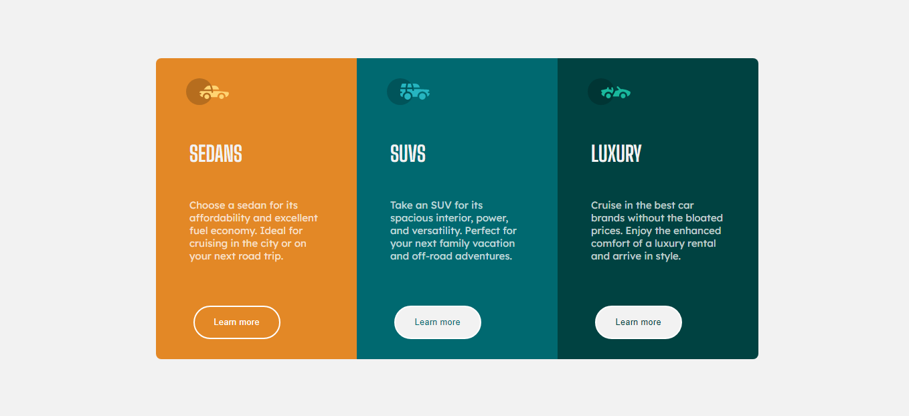
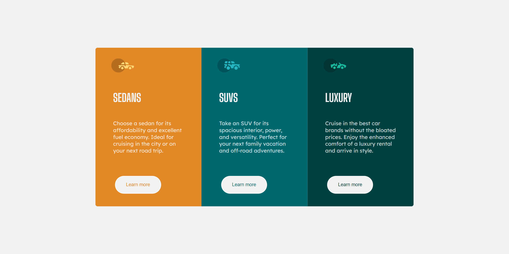
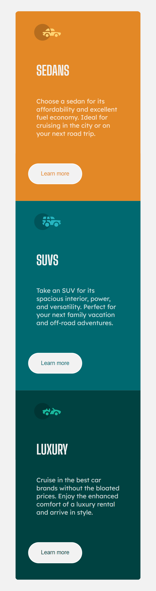

# FrontEndMentorChallenge
Frontend Mentor | 3-column preview card component

This is a solution to the [3-column preview card component challenge on Frontend Mentor](https://www.frontendmentor.io/challenges/3column-preview-card-component-pH92eAR2-). Frontend Mentor challenges help you improve your coding skills by building realistic projects. 

## Table of contents

- [Overview](#overview)
  - [The challenge](#the-challenge)
  - [Screenshot](#screenshot)
  - [Links](#links)
- [My process](#my-process)
  - [Built with](#built-with)
- [Author](#author)

## Overview

### The challenge

Users should be able to:

- View the optimal layout depending on their device's screen size
- See hover states for interactive elements

### Screenshot

  
Active State

  

  
 Desktop

  

  
 Mobile

  

### Links

- Solution URL: [click here](https://github.com/krtksharma/FrontEndMentorChallenge6)
- Live Site URL: [click here](https://krtksharma.github.io/FrontEndMentorChallenge6/)

## My process

### Built with

- Semantic HTML5 markup
- CSS custom properties
- Flexbox
- CSS Grid
- Media Queries

## Author

- Frontend Mentor - [@krtksharma](https://www.frontendmentor.io/profile/krtksharma)
